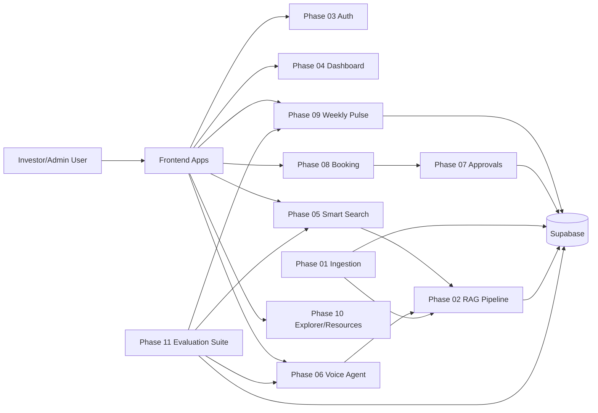
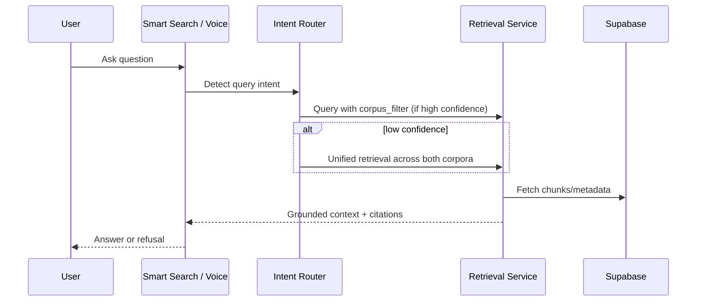

# Investor Ops Intelligence Suite

An AI-powered fintech operations platform that unifies:
- factual mutual-fund + fee Q&A (RAG),
- weekly app-review intelligence,
- voice-assisted advisor booking,
- human approval workflows,
- and an evaluation suite for trust, safety, and quality.

This repository contains the full multi-phase implementation (`phase-01` to `phase-11`) plus architecture docs, validation artifacts, and deployment workflows.

## Problem Statement (Why This Project Exists)

Investment support operations are usually fragmented:
- Investors ask repeated fund/fee questions that should be self-serve.
- Product feedback sits in raw review dumps instead of becoming weekly action.
- Voice-first users have poor support options.
- AI-generated actions (emails/calendar notes) can create compliance risk without approval gates.
- Teams lack measurable evidence that AI outputs are faithful, relevant, and safe.

This project solves that by building one connected system where users can move from query -> answer -> booking -> approved action, while admins retain oversight and evaluation visibility.

## What This Product Does

### Core Capabilities

1. **Mutual Fund + Fee Knowledge Assistant**
   - RAG-backed answers grounded in official scraped sources.
   - Intent-first corpus routing across:
     - fund facts corpus (`mutual_fund_data`)
     - fee explainer corpus (`fee_explainer_data`)
   - Safe refusal behavior for investment advice and PII requests.

2. **Weekly Product Pulse**
   - Ingests app reviews, extracts trends/themes, and generates weekly summaries.
   - Stores generated pulse outputs in Supabase for cross-module reuse.
   - Feeds context into related modules (dashboard and voice experience).

3. **Voice Agent + Booking Workflow**
   - Voice/text interaction mode.
   - Session continuity and history.
   - Booking flow with booking code generation and approval-gated downstream actions.

4. **Approval Center**
   - Human-in-the-loop layer for sensitive actions (calendar/email/doc actions).
   - Review/edit/approve/reject control before execution.

5. **Evaluation Suite (Phase 11)**
   - Runs measurable evals:
     - RAG faithfulness + relevance
     - adversarial safety/refusal tests
     - UX structure checks
   - Persists evaluation runs/cases.
   - Generates `Docs/Architecture/Evals-Report.md` as a derived report artifact.

## User Journeys

### Investor Journey

1. Sign in once.
2. Land on the dashboard with key metrics.
3. Ask fund/fee questions in Smart Search or Voice Agent.
4. Get grounded answers with citations (or refusal when unsafe).
5. Continue to booking when needed.
6. Track bookings, statuses, and context across modules.

### Admin Journey

1. Sign in to admin view.
2. Monitor KPIs, pulse trends, and pending actions.
3. Review approval queue for AI-generated operations.
4. Approve/reject/edit actions before they execute.
5. Run/inspect evaluation suite outputs for quality governance.

## Phase-by-Phase Map

- `phase-01-data-ingestion`: scraper + validation + Supabase writes (+ JSON snapshots)
- `phase-02-rag-pipeline`: chunking, embeddings, retrieval, query/refresh APIs
- `phase-03-auth`: authentication + role-based profile/session layer
- `phase-04-dashboard`: unified role-aware dashboard UI
- `phase-05-smart-search`: multi-session RAG chat
- `phase-06-voice-agent`: voice/text assistant with session persistence
- `phase-07-intent-approvals`: intent detection + approval workflow
- `phase-08-calendar-booking`: booking engine + MCP/Gmail/calendar integrations
- `phase-09-weekly-pulse`: review analytics + LLM pulse generation
- `phase-10-explorer-resources`: mutual fund explorer + fee resource hub
- `phase-11-evaluation-suite`: eval orchestration, APIs, report generation

## Data and Knowledge Flow

1. **Ingestion** pulls mutual-fund and app-review data, validates, stores snapshots, then writes to Supabase.
2. **RAG pipeline** refreshes indices/chunks from Supabase tables (fund + fee corpora).
3. **Search/Voice** retrieve corpus-specific or unified context based on query intent confidence.
4. **Weekly Pulse** transforms reviews into insights and stores latest summaries.
5. **Booking/Approvals** use authenticated user context and approval rules for operational actions.
6. **Evaluation suite** scores system behavior and writes report artifacts.

## Architecture Diagrams

### System View

### Retrieval Path (Fund + Fee Corpora)

## Key Product Guarantees

- No direct investment advice.
- No PII extraction/unsafe response allowance.
- Approval gating for operationally sensitive actions.
- Single-login cross-phase navigation continuity.
- Explicit source-grounded behavior for factual responses.

## Repository Docs You Should Read First

- `Docs/Problemstatement.md` -> business + user pain framing
- `Docs/PRD.md` -> product requirements and acceptance criteria
- `Docs/Architecture/architecture.md` -> implementation architecture by phase
- `Docs/Architecture/HLD.md` and `Docs/Architecture/LLD.md` -> design depth
- `Docs/Architecture/Evals-Report.md` -> latest evaluation outcomes
- `Docs/Architecture/Source-Manifest.md` -> official source URL manifest

## Local Setup

### Prerequisites

- Python 3.11+ (3.12 recommended in workflows)
- Node.js 18+ and npm
- Supabase project (URL + keys)
- OpenRouter API key (for LLM-routed modules)

### 1) Clone and install per phase

Each phase is independently runnable. Install dependencies inside each relevant phase:

- Python phases: `pip install -r requirements.txt`
- Frontend phases: `npm install` in `frontend/` directories

### 2) Configure environment files

Set required `.env` values for the phases you run (Supabase/OpenRouter/auth and module-specific keys). Use existing `.env.example` style files where present.

### 3) Start services

Run backend and frontend services phase-by-phase as needed (see each phase `README.md` for exact commands and ports).

## Local Dev Matrix (Quick Start by Phase)

| Phase | Purpose | Backend Run | Frontend Run | Default Ports | Key Env (minimum) |
|---|---|---|---|---|---|
| `phase-01-data-ingestion` | Scrape + validate + write | `python run_scraper.py` | N/A | N/A | `SUPABASE_URL`, `SUPABASE_SERVICE_ROLE_KEY` |
| `phase-02-rag-pipeline` | Chunk/embed/retrieve | `uvicorn backend.app:app --reload --port 8002` | N/A | `8002` | `SUPABASE_URL`, `SUPABASE_SERVICE_ROLE_KEY`, `OPENROUTER_API_KEY` |
| `phase-03-auth` | Auth + profiles | `uvicorn backend.main:app --reload --port 8003` | `npm run dev` (in `frontend`) | `8003`, `5173` | Supabase project URL/key + JWT/auth settings |
| `phase-04-dashboard` | Unified dashboard | `uvicorn backend.main:app --reload --port 8004` | `npm run dev` (in `frontend`) | `8004`, `5174` | Dashboard API base + Supabase public keys |
| `phase-05-smart-search` | RAG chat UI/API | `uvicorn backend.main:app --reload --port 8005` | `npm run dev` (in `frontend`) | `8005`, `5175` | `OPENROUTER_API_KEY`, RAG API base, Supabase vars |
| `phase-06-voice-agent` | Voice + text assistant | `uvicorn backend.main:app --reload --port 8006` | `npm run dev` (in `frontend`) | `8006`, `5176` | `OPENROUTER_API_KEY`, Supabase vars, voice frontend env |
| `phase-07-intent-approvals` | Approval workflow | `uvicorn backend.main:app --reload --port 8007` | (integrated via host UIs) | `8007` | Supabase vars, approval-service env |
| `phase-08-calendar-booking` | Booking + email/calendar | `uvicorn backend.main:app --reload --port 8008` | `npm run dev` (in `frontend`) | `8008`, `5177` | Supabase vars, Google/Gmail/calendar credentials |
| `phase-09-weekly-pulse` | Review analytics + summary | `uvicorn backend.main:app --reload --port 8009` | `npm run dev` (in `frontend`) | `8009`, `5178` | Supabase vars, `OPENROUTER_API_KEY` |
| `phase-10-explorer-resources` | Fund explorer + fee hub | `uvicorn backend.main:app --reload --port 8010` | `npm run dev` (in `frontend`) | `8010`, `5179` | Supabase vars |
| `phase-11-evaluation-suite` | Evals + report sync | `uvicorn backend.main:app --reload --port 8011` | N/A | `8011` | `SUPABASE_URL`, `SUPABASE_SERVICE_ROLE_KEY`, `OPENROUTER_API_KEY` |

> Note: exact port/env naming can differ slightly by phase; each phase-level `README.md` and `.env` is the source of truth for that module.

## Scheduling and Automation

GitHub Actions included in this repo:
- Daily mutual-fund scrape workflow
- Weekly app-review scrape workflow
- Weekly eval report sync workflow

These workflows are designed for CI scheduling and can be triggered manually as well.

## Deployment Targets (Current)

- **Frontend:** Vercel
- **Backend:** Render

Architecture and deployment notes are documented in `Docs/Architecture/architecture.md`.

## Testing and Validation

- Unit/integration tests exist across phases under each `tests/` folder.
- Evaluation suite adds quality gates for RAG, safety, and UX constraints.
- Output artifacts are maintained in each phase under `expected_outputs/` and in architecture docs.

## Who This Is For

- Fintech product teams building safe AI-assisted support flows
- Ops/admin teams requiring governance over AI-generated actions
- Engineers needing a reference implementation of a phased, full-stack, eval-driven AI ops system

## Project Status

`v1` implementation is complete across phases 01-11, with documentation and evaluation artifacts aligned for submission and deployment readiness.
